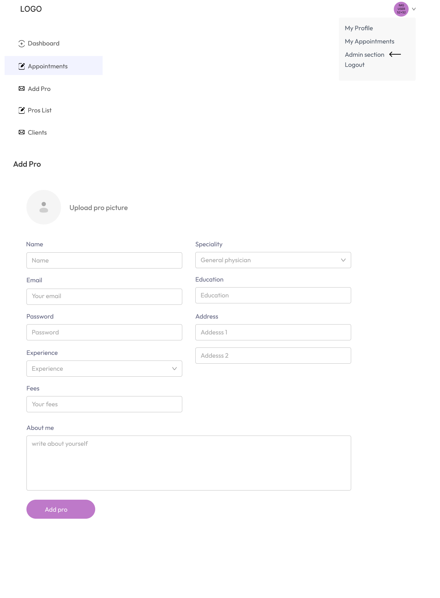
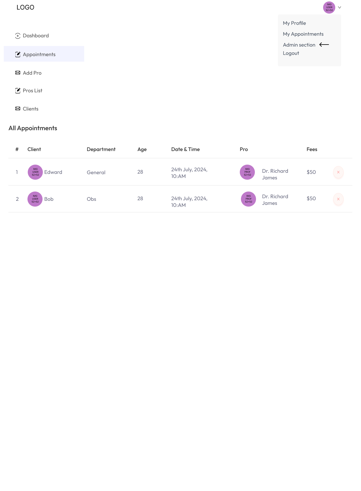

# Book a pro

A professional appointment platform.

## Sections

- Home
  - List of specialities (quick link to list of all professionals for selected specialities)
  - List of all professionals by specialities
  - Top 5 professionals list (with most appointments)
- About the app
- Contact the app owner or a professionals
- Header
  - Logo
  - Navigation
    - Home
    - All professionals
    - About
    - Contact
  - Create account (if not authenticated) / Update account (if authenticated)
- Footer

## Roles

- Administrators
- professionals
- clients

### Administrators

- Create and update physician (professionals)
- Create and update specialities (e.g. General physician, gynecologist, dematologirst, peratricians, neurologist, gatroenterologist...)

### clients

- Create a new account (self registration)
- Update their profiles
- Requests appointments
- Check teir professionals (professionals have/had appointments with)
- Online payment

### Professionals

- Update their profiles
- Check their appointments with clients
- Check their earnings
- Check their clients (clients have/had appointments with)

# Screens - Ideas

Those are just mockups / ideas made in [Figma](https://www.figma.com/)

## Home page

## About us page

## Contact us page

## Pros list page

## Pro details with availability page

## Login page

## Create account page

## User profile page

## User appointments page

## Admin - Dashboard

## Admin - Add professionals

## Admin - Check appointments

# Implementation

- GUI
  - WEB
    - REACTJS
      - VITE
- DATABASES
  - MONGODB
