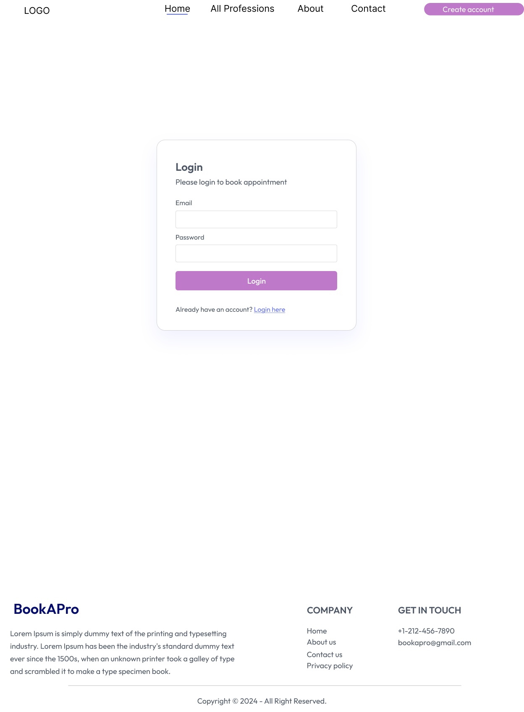
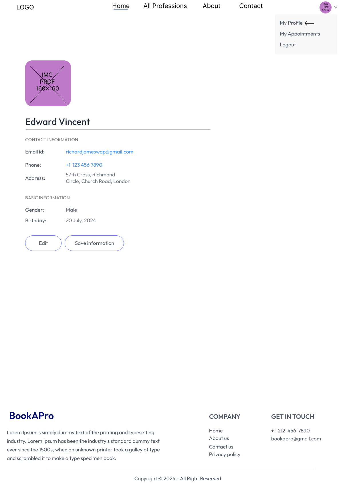
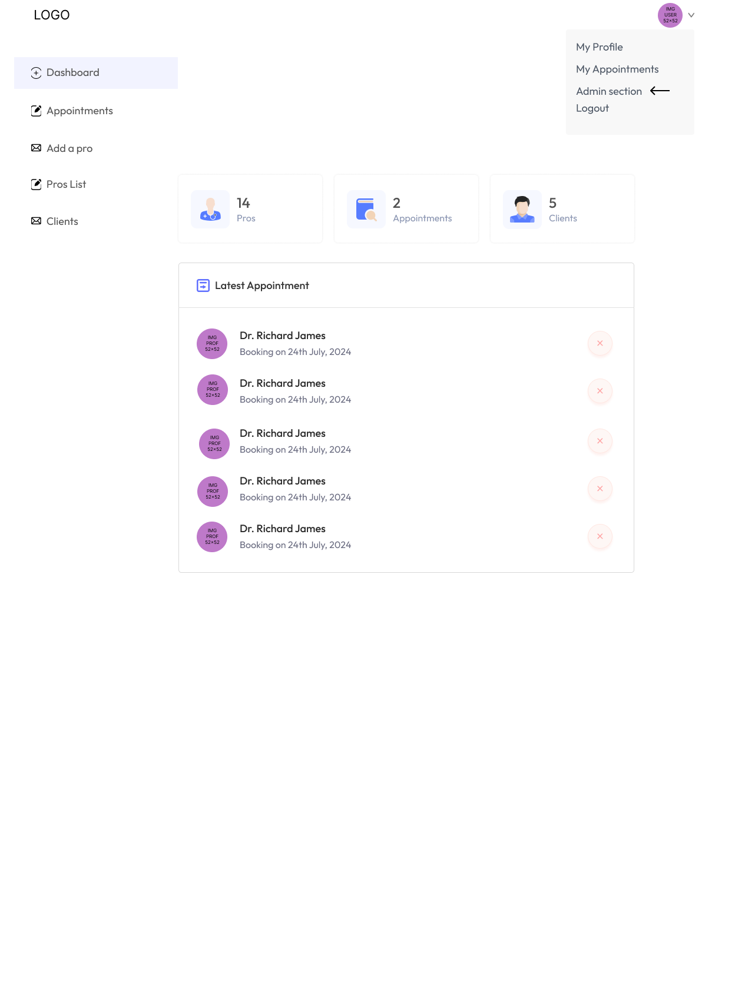

# Doctor Appointment

A doctor appointment platform.

## Sections

- Home
  - List of specialities (quick link to list of all doctors for selected specialities)
  - List of all doctors by specialities
  - Top 5 doctors list (with most appointments) 
- About the app
- Contact the app owner or a doctor
- Header
  - Logo
  - Navigation
    - Home
    - All doctors
    - About
    - Contact
  - Create account (if not authenticated) / Update account (if authenticated)
- Footer

## Roles

- Administrators
- Doctors
- Patients

### Administrators

- Create and update physician (doctors)
- Create and update specialities (e.g. General physician, gynecologist, dematologirst, peratricians, neurologist, gatroenterologist...)

### Patients

- Create a new account (self registration)
- Update their profiles
- Requests appointments
- Check teir doctors (Doctors have/had appointments with)
- Online payment

### Doctors / Physicians

- Update their profiles- 
- Check their appointments with patients
- Check their earnings
- Check their patients (Patients have/had appointments with)

# Screens - Ideas

Those are just mockups / ideas made in [Figma](https://www.figma.com/)

## Home page

## About us page

## Contact us page

## Docs list page

## Doc details with availability page

## Login page

## Create account page

## User profile page

## User appointments page

## Admin - Dashboard

## Admin - Add doc

## Admin - Check appointments

# Implementation

- GUI
  - WEB
    - REACTJS
      - VITE
- DATABASES
  - MONGODB